# Hands-on 建置文件

## 映像檔匯入

開啟Cloud Shell 使用以下指令匯入此次hands-on所需要的image

注意事項 :

- 執行後約需等待30~60分鐘左右

- Cloud Shell 放置到timeout不會影響匯入

- 可至[映像檔](https://console.cloud.google.com/compute/images)頁面查看是否匯入完成

### IIS image

```
gcloud compute images create iis-workshop-template-pnhandson \
    --source-uri gs://[sourceBucket]/[sourceFile].tar.gz \
    --guest-os-features=MULTI_IP_SUBNET,UEFI_COMPATIBLE,VIRTIO_SCSI_MULTIQUEUE,WINDOWS \
    --licenses "https://www.googleapis.com/compute/v1/projects/windows-cloud/global/licenses/windows-server-2019-dc" \
    --storage-location=asia-east1
```    

### GitLab image

```
gcloud compute images create gitlab-template-pnhandson \
    --source-uri gs://[sourceBucket]/[sourceFile].tar.gz \
    --licenses "https://www.googleapis.com/compute/v1/projects/vm-options/global/licenses/enable-vmx" \
    --storage-location=asia-east1
```

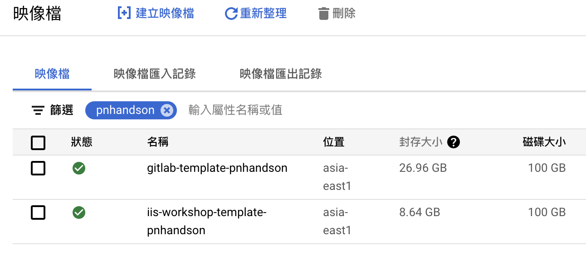


---

## 建立GCS Bucket

### 取得Project ID

請先查看您的`project-id`，在首頁專案資訊中可查看`專案ID`
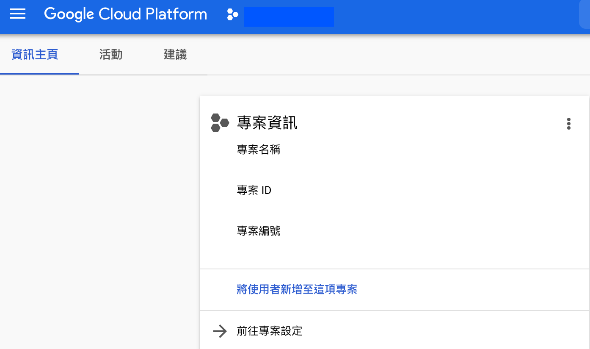

### 建立Bucket

1. 進入[Cloud Storage](https://console.cloud.google.com/storage/browser) -> 瀏覽器
2. 建立存放 terraform state 的值區 為值區命名 : `<project_id>-tf-backend-pnhandson`

選取資料的儲存位置 : 

- [ ✓ ] Region -> asia-east1 (台灣)

- 為資料選擇預設儲存空間級別 : Stardard

- 選取如何控制物件的存取權 : 統一

- 進階設定 (選用) : Google 代管的加密金鑰

3.重複前兩步驟 
再建立一個值區存放gitlab artifacts : `<project_id>-cicd-workshop-pnhandson`

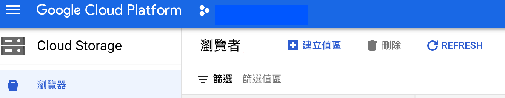
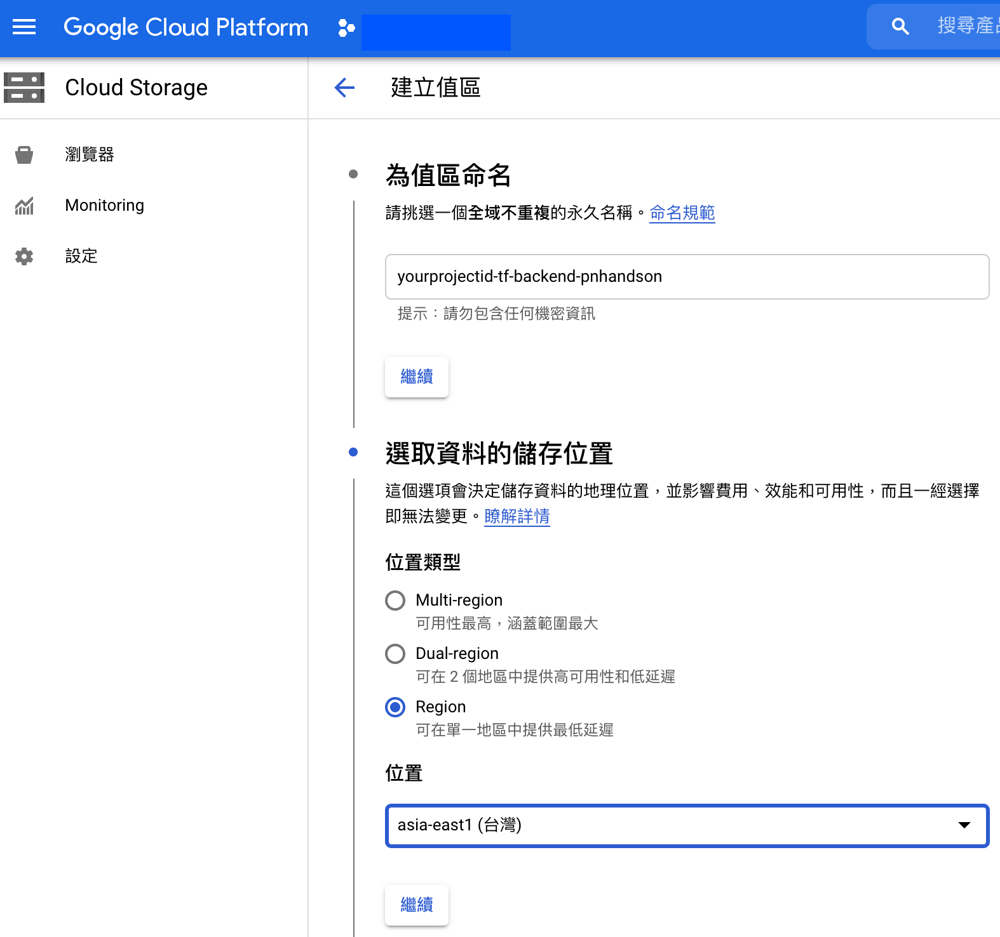

---

## 建立防火牆規則

1. 至[防火牆](https://console.cloud.google.com/networking/firewalls)頁面 -> 建立防火牆規則

- 名稱 : `gitlab-firewall-pnhandson`
- 目標 : 指定的目標標記
- 目標標記 : `gitlab-pnhandson`
- 來源篩選器 : IP範圍
- 來源IP範圍 : 您的對外IP , [可使用myipcheck](https://myip.com.tw/)
- 通訊協定和埠 : 指定的通訊協定和埠
- [ ✓ ] tcp: 80,443,9090,3389

2. 建立

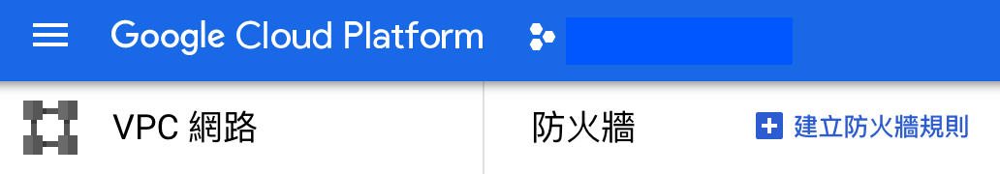
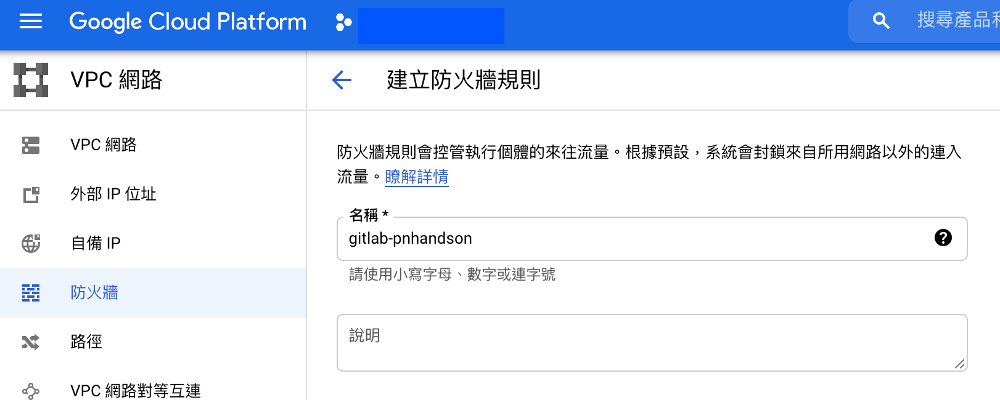


---

## 建立Service Account

請至[API和服務](https://console.cloud.google.com/apis/credentials) -> `憑證` -> `建立憑證` -> `服務帳戶` 建立

1. service account name 使用`svracct-pnhandson`

2. 此service account需要的權限:
- Compute Netwrok Admin
- Compute Admin
- Storage Object Admin
- Service Account User

> 建立後, 請點選進入此Service Account

3. 產生 credential json
4. 產生跟下載 credential json
5. 下載 credential json
6. credential json 內容 sample

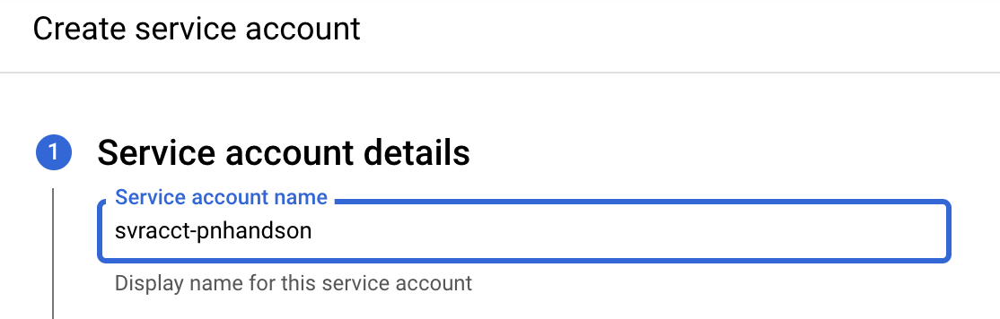
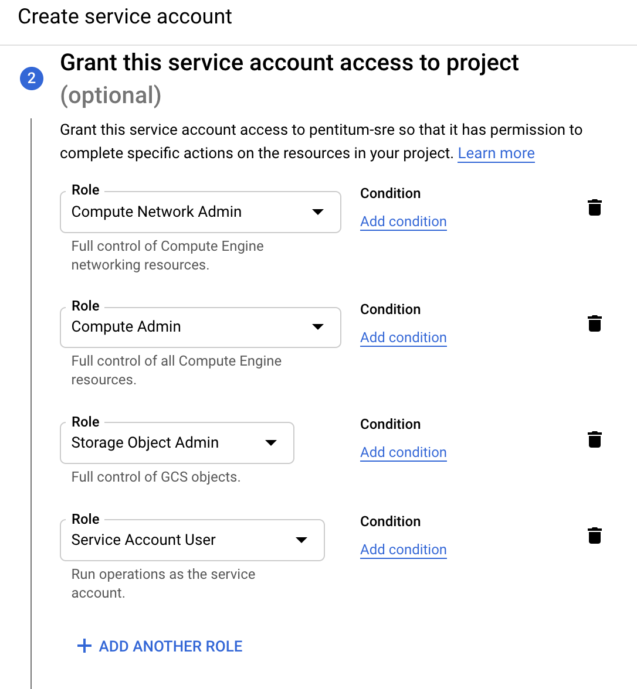
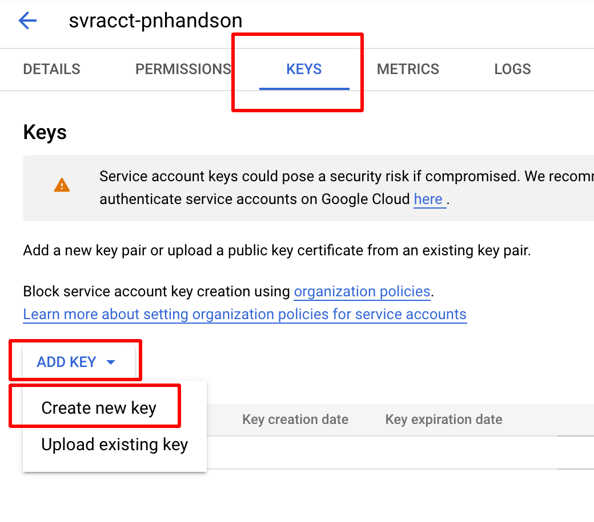
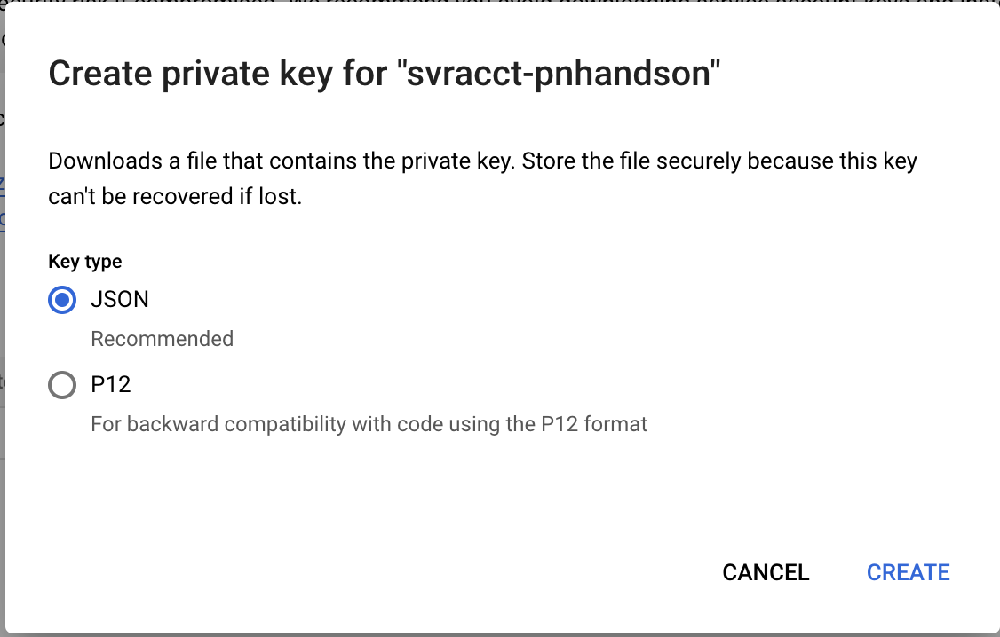
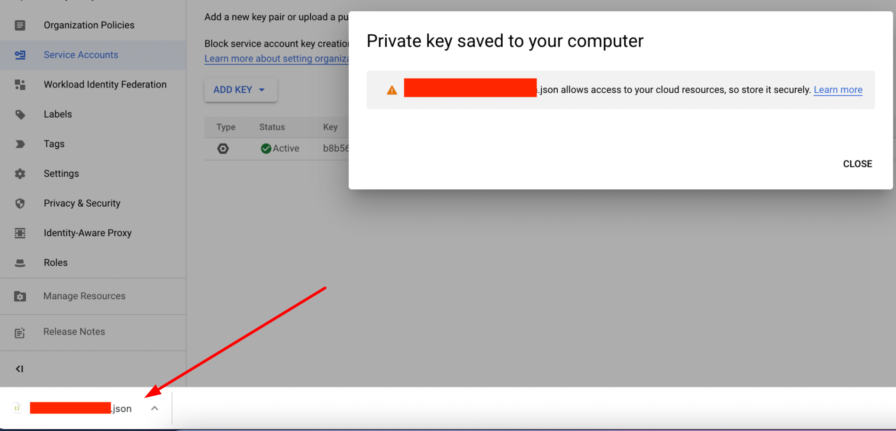
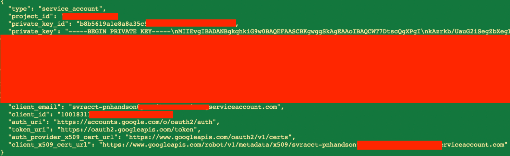

---

## 清除本次Hands-on所建立之資源

### 注意事項

- 如果建立Region不同的話刪除的時候請注意自己更換帶入的Region參數

### 清除指令

- GCE image
```
# 查詢
gcloud compute images list | grep pnhandson

# 清除指令
gcloud compute images delete [imagename]

例 :
gcloud compute images delete gitlab-template-pnhandson
```

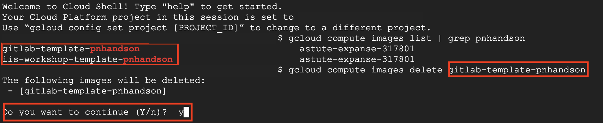

- GCE instance

```
# 查詢
gcloud compute instances list | grep pnhandson

# 清除指令
gcloud compute instances delete [instance-name] --zone=asia-east1-b

例：
gcloud compute instances delete gitlab-pnhandson --zone=asia-east1-b
```
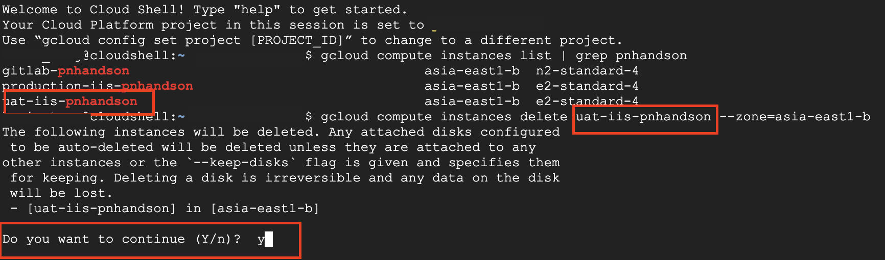

- Network firewall (可以一次刪除多組)
```
# 查詢
gcloud compute firewall-rules list | grep pnhandson

# 清除指令
gcloud compute firewall-rules delete [name] [name2]

例：
gcloud compute firewall-rules delete gitlab-firewall-pnhandson production-gitlab-deploy-firewall-pnhandson production-iis-rdp-firewall-pnhandson production-iis-web-firewall-pnhandson uat-gitlab-deploy-firewall-pnhandson uat-iis-rdp-firewall-pnhandson uat-iis-web-firewall-pnhandson
```

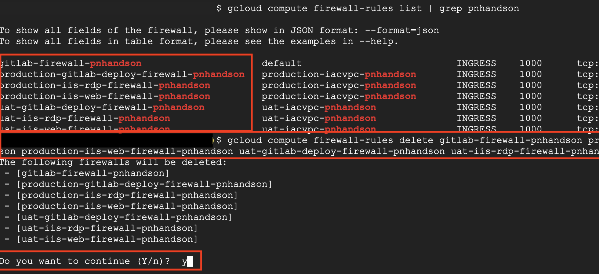

- Vpc network (可以一次刪除多組)
```
# 查詢   
gcloud compute networks list | grep pnhandson

# 清除指令
gcloud compute networks delete network-name

例：
gcloud compute networks delete production-iacvpc-pnhandson uat-iacvpc-pnhandson
```

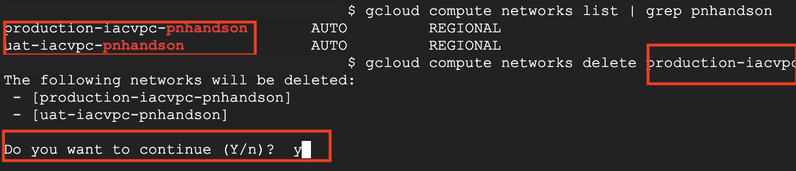

- GCS
```
# 查詢
gsutil ls | grep pnhandson

# 清除指令
gsutil -m rm -r gs://bucket_name/

例：
gsutil -m rm -r gs://pentitum-sre-tf-backend-pnhandson/
```

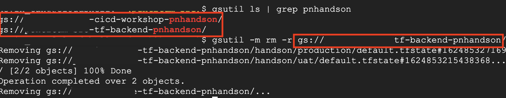

- Static ip  (可以一次刪除多組)
```
# 查詢
gcloud compute addresses list | grep pnhandson

# 清除指令
gcloud compute addresses delete address-name --region=asia-east1

例：
gcloud compute addresses delete production-iis-ip-pnhandson uat-iis-ip-pnhandson --region=asia-east1
```

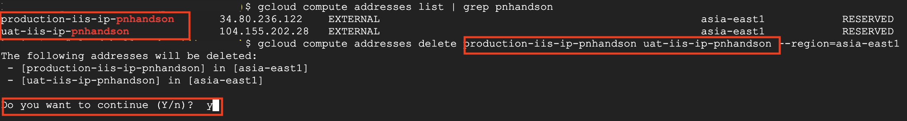

- Service Account
```
# 查詢
gcloud iam service-accounts list | grep pnhandson

# 清除指令
gcloud iam service-accounts delete my-iam-account@my-project.iam.gserviceaccount.com
```
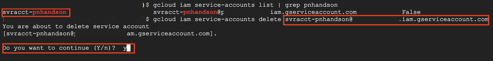

---

## GitLab建立

1. 使用已經匯入完成的image 

選擇`gitlab-template-pnhandson`
  
- 從[映像檔](https://console.cloud.google.com/compute/images)建立虛擬機器
- 名稱: `gitlab-pnhandson`
- 區域: asia-east1 (台灣) / asia-east1-b
- 規格:N2 / n2-standard-4 (4個 vCPU ， 16 GB記憶體)

2. 選取網路 -> 網路標記

- 設定剛剛的rule網路標記
`gitlab-pnhandson`

3. 建立

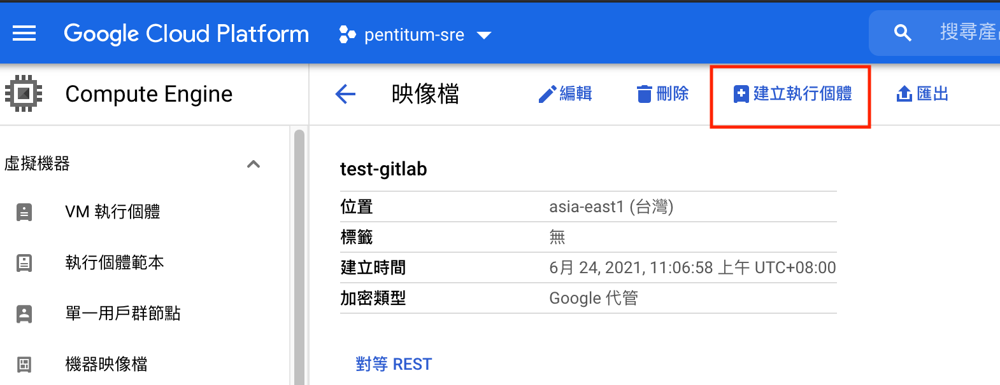
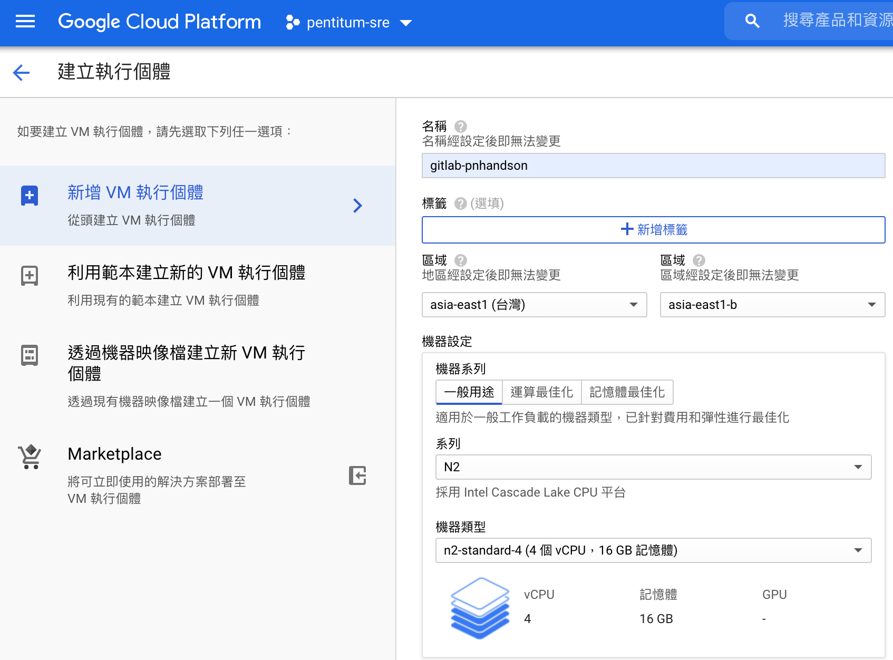
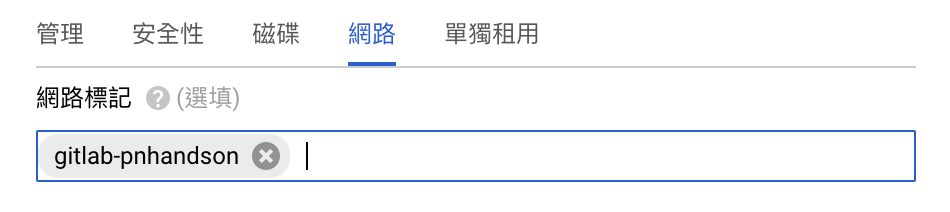

- 等待約略五分鐘後所有服務皆啟用完成

4. 建立後會自動產生兩組URL

格式為:

```
GITLAB URL: https://gitlab-您的IP.nip.io
COCKPIT URL: https://cockpit-您的IP.nip.io:9090
```

- 在`您的 IP `部分`請將 . 換成 - ` , 如範例所示

例:

```
GITLAB URL: https://gitlab-34-80-72-130.nip.io
COCKPIT URL: https://cockpit-34-80-72-130.nip.io:9090
```

- 如果需要確認是否成功啟動所有服務請由Console的SSH進入此instance, 並使用指令查看

指令

```
sudo service-status
```

如果出現如下列資訊則為服務啟用成功,如否,請持續等待服務啟用完畢

```
Service Infomation:
COCKPIT URL: https://cockpit-35-201-185-33.nip.io:9090
GITLAB URL: https://gitlab-35-201-185-33.nip.io
Windows Server RDP IP: 35.201.185.33 Port: 3389, Account: Administrator
```

5. 進入GitLab

- 請由GITLAB URL進入Gitlab
Login帳密

```
root/ 7QKZfrxBQBip5D4
```

```
maintainer：maintainer_user / #rtyhnbvfg
developer：developer_user / @rtyhnbvfg
```

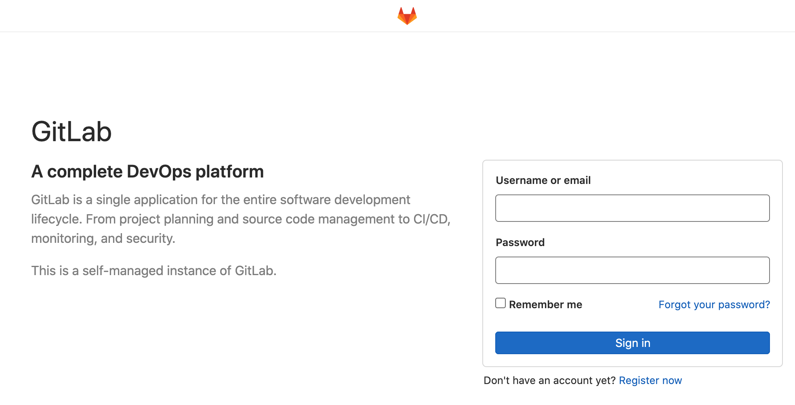

### Gitlab Troubleshooting

- 如碰到任何異常，需要查詢Windows Runner狀態可由COCKPIT URL進入管理介面
Login帳密

```
root / 12qw#$ER
```

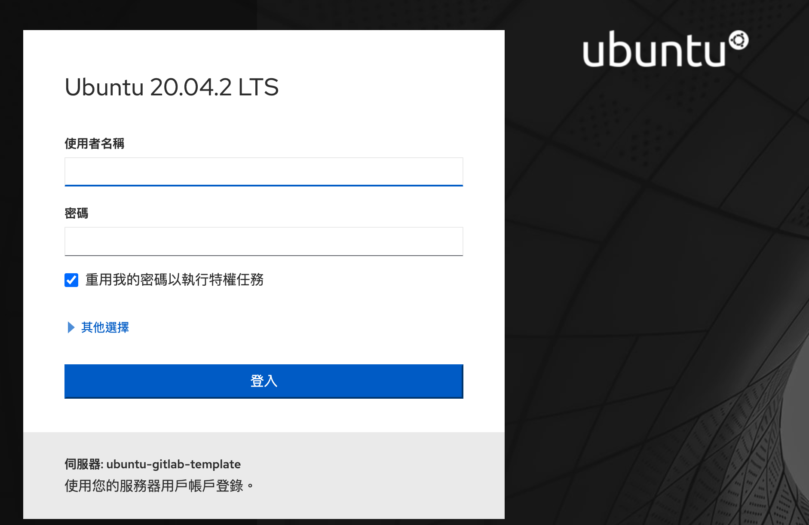
